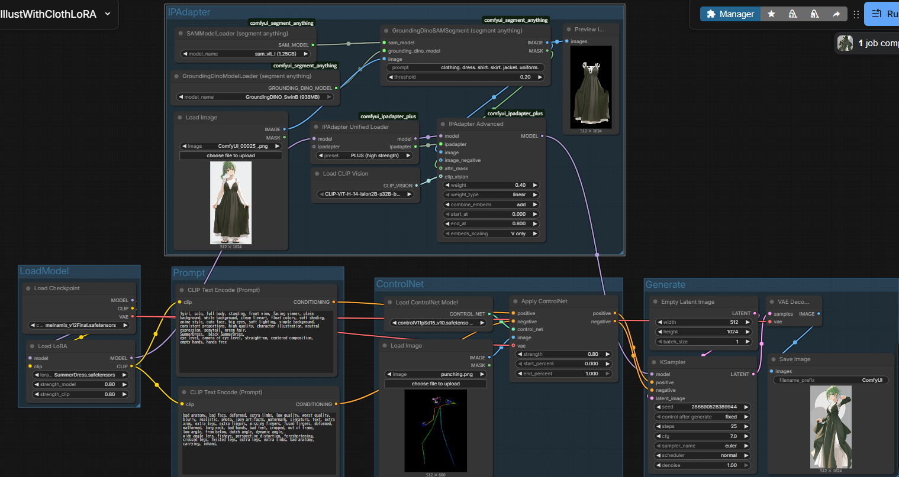
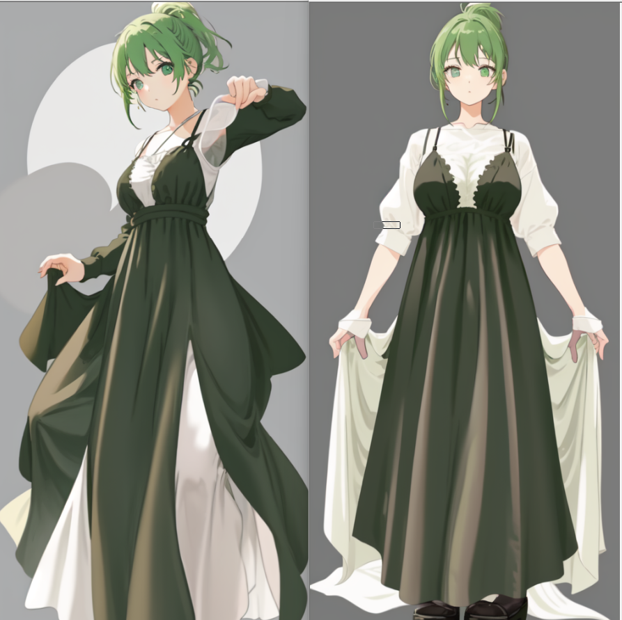

# Character Sprite Variation Workflow

[This workflow](../workflows/CharacterSpriteWorkflow.json) generates high-consistency character sprite variations without using high-performance models such as qwen-image-edit.
Although the number of test samples is still limited, I have achieved results that I’m satisfied with, so I’m publishing it for now.

## Workflow Overview

1. Generate an upright standing reference image in the target outfit using an outfit LoRA.
2. Use IP-Adapter with that standing image as the clothing reference.
3. Use OpenPose with ControlNet to lock the pose.
4. By combining the above, generate character sprite variations with improved consistency.

In the upper part of the workflow, you first generate an upright standing reference image with an outfit LoRA, and then load it.
Next, the outfit is detected using Segment Anything, and the result is used as a reference for IP-Adapter to stabilize the clothing.

In the lower part, ControlNet uses OpenPose to lock the pose.

For facial identity, the workflow intentionally avoids referencing the face with IP-Adapter, so the face is regenerated rather than being strongly influenced by the reference image.
By fixing the seed for each sprite, you can get faces that are somewhat similar across variations.
However, this is more of a “luck/heuristic” level approach, so I may later add a method to reference only the face with IP-Adapter or a similar technique.

