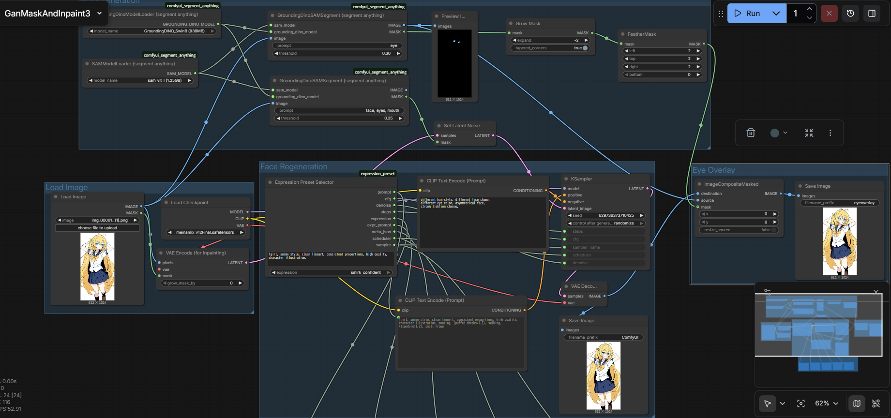
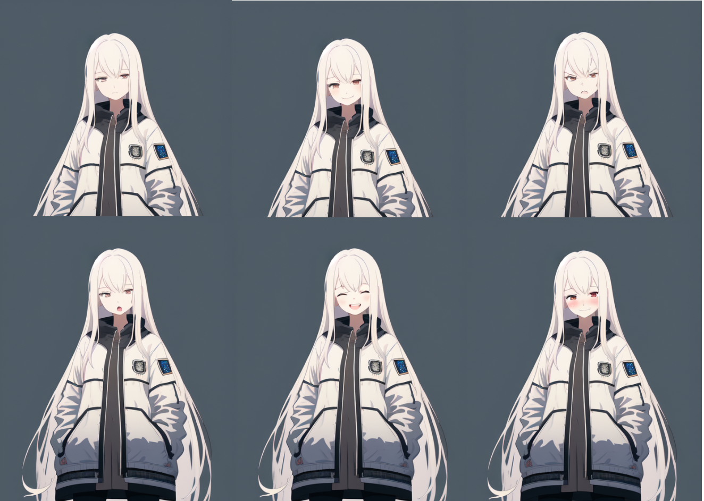
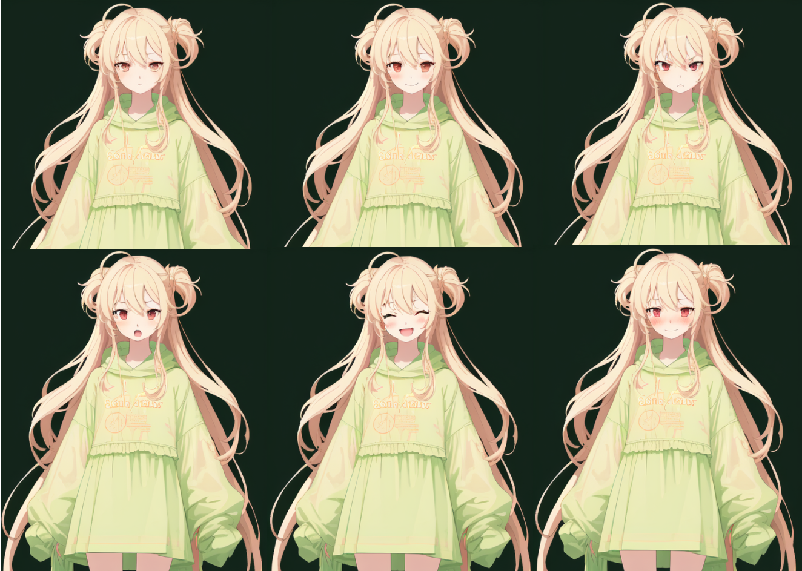
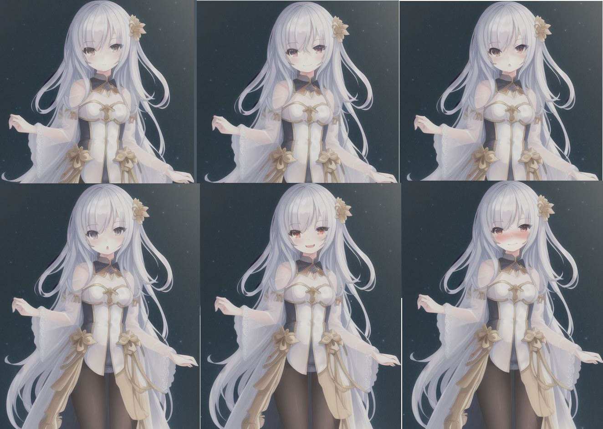
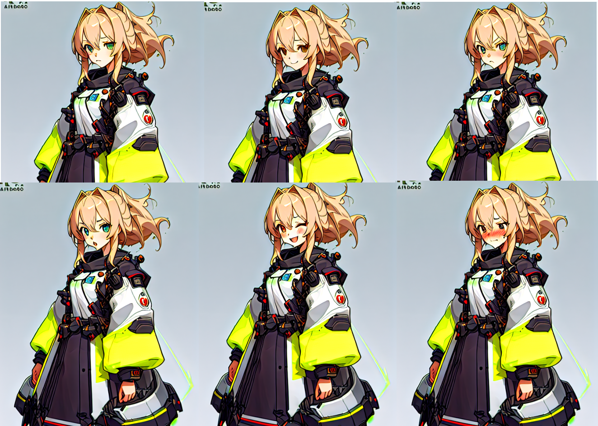
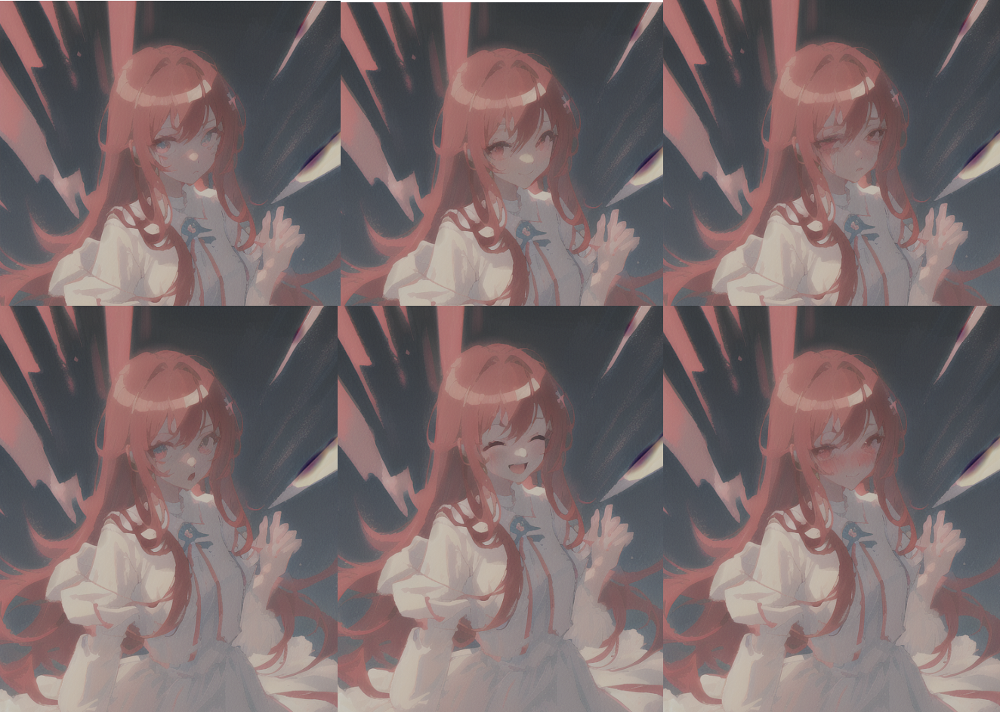

# Expression-Variation Workflow (ComfyUI)

[日本語](GenMaskAndInpaint.md) | English

The **Character Expression Variation Workflow** (`../workflow/GenmaskAndInpaint.json`) is a ComfyUI workflow + custom-node setup designed to generate expression variations from a standing character image **consistently and with minimal drift**.

Goals:

- Replace **only the face** via inpainting
- Keep identity (hair / outfit / silhouette) as much as possible
- Preset the best **denoise / CFG** per expression

With the workflow and custom nodes installed, you can choose the target expression from a dropdown in the `expression_preset` custom node, run the workflow, and get an image with the expression changed.





---

## Custom nodes used

### Mask generation

- **comfyui_segment_anything**
  - https://github.com/storyicon/comfyui_segment_anything?tab=readme-ov-file#groundingdino

- **expression_preset**
  - https://github.com/fujitea40/comfyui-experiments/tree/main/expression_preset

### Installation

For **comfyui_segment_anything**, follow the installation instructions in the linked repository.

For **expression_preset**, just check out this repository and place it under:

```text
ComfyUI/
  └── custom_nodes/
      └── expression_preset
```

> Note  
> Besides the custom nodes, the workflow JSON may contain model settings that were used for the author's own testing.  
> Please replace them with your own models and tune presets before use.

To change the preset parameters stored in `expression_preset`, see:
- [README](../expression_preset/README.en.md)

## Recommended base model

Expression changes worked relatively well with **SD 1.5–based models** (see the sample image above), while **SDXL** did not produce expressions as cleanly in the author’s tests.
This workflow is therefore intended primarily for **SD 1.5 models**.

## Verified models

- [MeinaMix v12](https://civitai.com/models/7240/meinamix)
- [Anything V3](https://civitai.com/models/66?modelVersionId=75)
  - For `BigSmile`, closed eyes may break easily — using a lower `denoise` is recommended.
- [Counterfeit-V3.0](https://civitai.com/models/4468?modelVersionId=57618)
  - More fragile; you may need multiple tries with different random seeds.
- [Pastel-Mix](https://civitai.com/models/5414?modelVersionId=6297)

## Planned updates

The higher the interest, the higher the priority—please submit requests via Issues if you’d like any of these.

- Optionally save “face-only” difference images as outputs.  
  (For standing-character use cases, full-body outputs with expression changes are usually enough, but can be added if requested.)
- Output all expressions in a single run.
- For practical use, integrate the approach from [comfyui-image-explorer](../comfyui-image-explorer/) to:
  - execute multiple parameter patterns via API in one batch
  - generate multiple candidates for the same expression and choose the best
- Automate variation generation for other parts (pose, hairstyle, accessories)
- Improve stability with ControlNet  
  (In SDXL tests, higher `denoise` was required to see an effect, but that also increased deformation.)

## Generation samples

- MeinaMix  
  
- Anything  
  
- Counterfeit  
  
- Pastel-Mix  
  

## License

Copyright (c) 2025 fuji-tea  
Released under the MIT License.

## Contributing

Bug reports and feature requests are welcome via Issues.  
Pull requests are also welcome.

## Changelog

### v1.0.0
- 2025-12-28 Initial release
