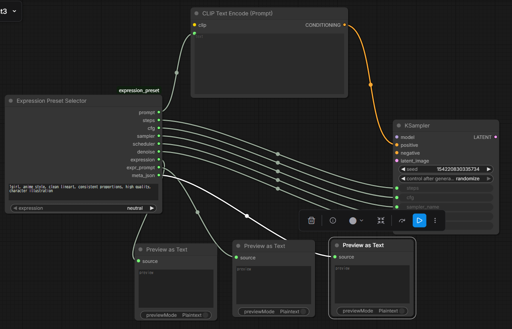

# Expression Preset Custom Node

[日本語](README.md) | English

This custom node lets you **predefine** a prompt fragment and KSampler parameters for each expression name (e.g., `smile`, `angry`).
By selecting an expression from a dropdown, the node outputs:

- the corresponding **positive prompt text**, and
- the corresponding **KSampler parameter overrides**

so you can switch expressions quickly without manually editing prompts/values every time.

---

## Installation

1. Copy this repository folder (`expression_preset`) under `ComfyUI/custom_nodes/`:

```text
ComfyUI/
  └── custom_nodes/
      └── expression_preset
          ├── __init__.py
          ├── expression_preset.py
          └── expression_presets.yaml   # config file
```

2. Edit `expression_presets.yaml` to match your preferences and your model.
   - Default values exist, so you only need to specify parameters you want to override.

Example:

```yaml
defaults:
  params:
    steps: 25
    cfg: 8.0
    denoise: 0.48
    scheduler: karras
    sampler: dpmpp_2m_sde

expressions:
  neutral:
    expr_prompt: "neutral expression, calm face, relaxed mouth, eyes open, relaxed eyes, emotionless, natural look, same eye color, consistent eye color"
    params:
      denoise: 0.28
      scheduler: karras
      sampler: dpmpp_2m_sde
```

---

## How to use

Connect the outputs of **Expression Preset Selector** to your workflow as follows:

- Connect the prompt output to your **Text Encoder** node (positive prompt side)
- Connect the parameter outputs to your **KSampler** node inputs



---

## License

Copyright (c) 2025 fuji-tea  
Released under the MIT License.

## Contributing

Bug reports and feature requests are welcome via Issues.  
Pull requests are also welcome.

## Changelog

### v1.0.0
- 2025-12-28 Initial release

### v1.0.1
- 2026-01-08 Added support for reading scheduler and sampler from yaml
